# CONITRACK - Árbol de Flujos Válidos de Casos de Uso

**Versión:** 2.0
**Fecha:** 2025-11-01
**Sistema:** CONITRACK - Gestión de Stock Farmacéutico
**Propósito:** Documentar TODOS los flujos secuenciales válidos entre CU según lógica de negocio

---

## Tabla de Contenidos

1. [Introducción](#introducción)
2. [Reglas Fundamentales](#reglas-fundamentales)
3. [Catálogo de CU](#catálogo-de-cu)
4. [Estados y Dictámenes](#estados-y-dictámenes)
5. [Flujos Principales - Productos NO Trazados](#flujos-principales---productos-no-trazados)
6. [Flujos Principales - Productos Trazados](#flujos-principales---productos-trazados)
7. [Flujos de Contingencia](#flujos-de-contingencia)
8. [Flujos Automáticos](#flujos-automáticos)
9. [Reversos y Restricciones](#reversos-y-restricciones)
10. [Diagramas Mermaid Completos](#diagramas-mermaid-completos)

---

## Introducción

Este documento describe **QUÉ CU puede ejecutarse después de OTRO CU** basándose en las reglas de negocio implementadas en el código.

### Objetivo

Definir los flujos secuenciales válidos para:
- Desarrollo de guía de usuario
- Capacitación de operadores
- Validación de procesos de negocio
- Diseño de pruebas de integración

### Notación

```
CU# (Nombre) [Condición]
  └─→ CU# (Nombre) [Condición resultante]
```

**Símbolos:**
- `✅` Operación permitida
- `⛔` Operación bloqueada
- `🔄` Operación reversible
- `🤖` Operación automática
- `⚠️` Operación terminal

---

## Reglas Fundamentales

### 1. Pre-condiciones de Dictamen

| CU | Dictamen Requerido |
|----|--------------------|
| **CU2** (Cuarentena) | RECIBIDO, APROBADO, ANALISIS_EXPIRADO |
| **CU3** (Muestreo) | CUARENTENA |
| **CU5/6** (Resultado) | CUARENTENA (requiere CU3 previo) |
| **CU7** (Consumo Producción) | APROBADO |
| **CU8** (Reanálisis) | APROBADO |
| **CU21** (Liberación) | APROBADO |
| **CU22** (Venta) | LIBERADO |
| **CU4** (Devolución Compra) | Cualquiera (excepto estados terminales) |
| **CU28** (Ajuste) | Cualquiera (excepto estados terminales) |

### 2. Estados Terminales

**CONSUMIDO**: Solo permite CU29 (Reverso)
**DEVUELTO**: Solo permite CU29 (Reverso)
**VENCIDO**: Solo permite CU28 (Ajuste para destrucción) y CU29 (Reverso)
**RECHAZADO**: Solo permite CU4 (Devolución) y CU28 (Ajuste) y CU29 (Reverso)
**RECALL**: Solo permite CU28 (Ajuste) y CU29 (Reverso)

### 3. Regla de Análisis Único en Curso

Un lote solo puede tener **1 análisis activo sin dictaminar** (`activo=true, dictamen=null, fechaRealizado=null`) a la vez.

---

## Catálogo de CU

| CU# | Nombre | Tipo | Motivo | Reversible |
|-----|--------|------|--------|------------|
| **CU1** | Alta Ingreso Compra | ALTA | COMPRA | 🔄 CU29 |
| **CU2** | Modificación Cuarentena | MODIFICACION | ANALISIS | 🔄 CU30 |
| **CU3** | Baja Muestreo | BAJA | MUESTREO | 🔄 CU29 |
| **CU4** | Baja Devolución Compra | BAJA | DEVOLUCION_COMPRA | 🔄 CU29 |
| **CU5** | Resultado Análisis APROBADO | MODIFICACION | RESULTADO_ANALISIS | 🔄 CU30 |
| **CU6** | Resultado Análisis RECHAZADO | MODIFICACION | RESULTADO_ANALISIS | 🔄 CU30 |
| **CU7** | Baja Consumo Producción | BAJA | CONSUMO_PRODUCCION | 🔄 CU29 |
| **CU8** | Reanálisis Producto | MODIFICACION | REANALISIS | 🔄 CU30 |
| **CU9** | Análisis Expirado | MODIFICACION | EXPIRACION_ANALISIS | 🤖 Auto |
| **CU10** | Vencimiento Producto | MODIFICACION | VENCIMIENTO | 🤖 Auto |
| **CU11** | Anulación Análisis | MODIFICACION | ANULACION_ANALISIS | 🔄 CU30 |
| **CU20** | Alta Ingreso Producción | ALTA | PRODUCCION | 🔄 CU29 |
| **CU21** | Liberación Ventas | MODIFICACION | LIBERACION | 🔄 CU30 |
| **CU22** | Baja Venta | BAJA | VENTA | 🔄 CU29 |
| **CU23** | Alta Devolución Venta | ALTA | DEVOLUCION_VENTA | 🔄 CU29 |
| **CU24** | Retiro Mercado (Recall) | ALTA+MODIF | RETIRO_MERCADO | ⛔ No reversible |
| **CU27** | Trazado Lote | MODIFICACION | TRAZADO | 🔄 CU30 |
| **CU28** | Ajuste Inventario | BAJA | AJUSTE | 🔄 CU29 |
| **CU29** | Reverso ALTA/BAJA | MODIFICACION | REVERSO | - |
| **CU30** | Reverso MODIFICACION | MODIFICACION | REVERSO | - |
| **CU31** | Reverso General | MODIFICACION | REVERSO | - |

---

## Estados y Dictámenes

### EstadoEnum (Lote/Bulto/Traza)

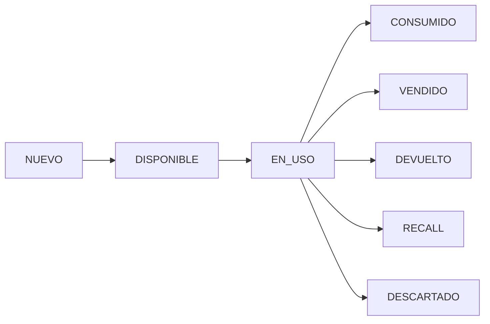

**Estados Terminales:** CONSUMIDO, VENDIDO, DEVUELTO, RECALL, DESCARTADO

### DictamenEnum (Lote)

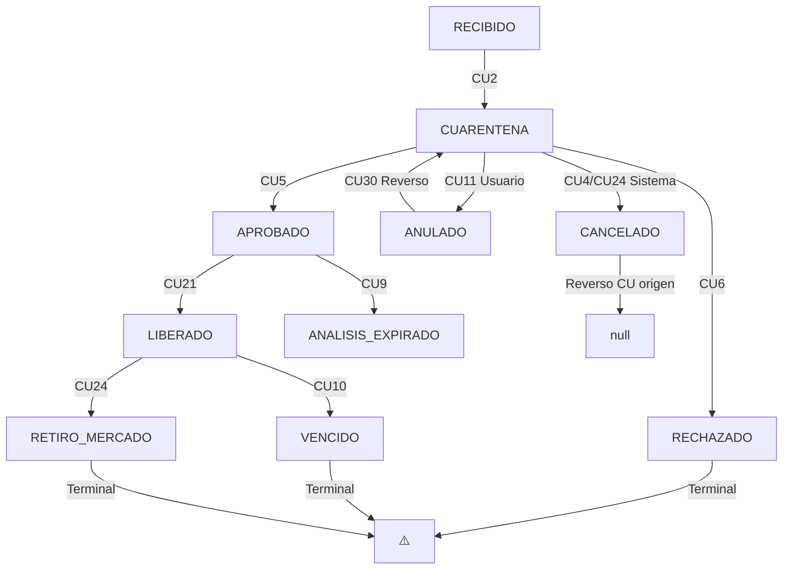

**Dictámenes Terminales:** RECHAZADO, VENCIDO, RETIRO_MERCADO

**Cancelación de Análisis:**
- **ANULADO**: Usuario cancela explícitamente un análisis en curso mediante **CU11**
- **CANCELADO**: Sistema cancela automáticamente el análisis cuando otras operaciones lo hacen irrelevante:
  - **CU4** (Devolución Compra): Lote devuelto, análisis no tiene sentido
  - **CU7** (Consumo Producción): Stock llega a 0, análisis ya no aplicable
  - **CU10** (Vencimiento): Producto vencido, análisis cancelado automáticamente
  - **CU22** (Venta): Stock llega a 0, análisis ya no aplicable
  - **CU24** (Recall): Lote en retiro, análisis cancelado
  - **CU28** (Ajuste): Stock ajustado a 0, análisis ya no aplicable

---

## Flujos Principales - Productos NO Trazados

### Flujo 1: Compra Externa → Análisis → Venta

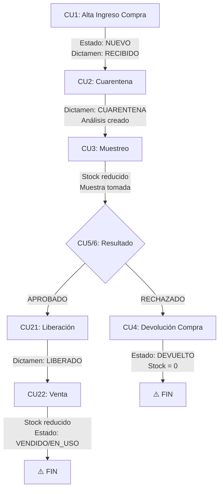

**Descripción paso a paso:**

1. **CU1 (Ingreso Compra)** `[dictamen: RECIBIDO, estado: NUEVO]`
   - **Descripción:** Alta de lote de producto externo recibido desde proveedor (NO Conifarma)
   - **Actor:** Analista de Planta
   - **Entrada requerida:**
     - Producto (API, EXCIPIENTE, ACOND_PRIMARIO, ACOND_SECUNDARIO)
     - Proveedor (NO Conifarma)
     - Cantidad inicial (> 0, entero si UNIDAD, >= bultos)
     - Bultos totales [1..n]
     - Lote proveedor
     - Fecha ingreso (≤ hoy)
   - **Genera automáticamente:**
     - Código lote: `L-{codigoProducto}-{yy.MM.dd_HH.mm.ss}`
     - Estado: NUEVO
     - Dictamen: RECIBIDO
     - Bultos con numeración [1..n]
     - Movimiento ALTA/COMPRA
   - **Validaciones aplicadas (15 total):**
     - JSR-303: @NotNull, @Positive, @Size (12 validaciones)
     - Custom: cantidad > 0, entero si UNIDAD, >= bultos
     - Fechas: reanalisis < vencimiento
     - Bultos: suma convertida = total (tolerancia 6 decimales)
   - **Reglas de negocio:**
     - País origen: DTO > Fabricante > Proveedor
     - Conversiones automáticas entre unidades compatibles
   - **Ver documentación completa:** [CU1_ALTA_INGRESO_COMPRA.md](./docs/cu/CU1_ALTA_INGRESO_COMPRA.md)
   - **Siguiente permitido:**
     - ✅ CU2 (Cuarentena) - **Flujo normal** para análisis
     - ✅ CU4 (Devolución) - Si se detecta error antes de análisis
     - ✅ CU28 (Ajuste) - Corrección de cantidades
     - ✅ CU29 (Reverso) - Anular ingreso (si no hay movimientos posteriores)

2. **CU2 (Cuarentena)** `[dictamen: CUARENTENA]`
   - **Siguiente permitido:**
     - ✅ CU3 (Muestreo) - **OBLIGATORIO** para analizar
     - ✅ CU11 (Anulación Análisis) - Si se cancela el análisis
     - ✅ CU30 (Reverso) - Volver a RECIBIDO

3. **CU3 (Muestreo)** `[dictamen: CUARENTENA]`
   - **Siguiente permitido:**
     - ✅ CU5/6 (Resultado) - **OBLIGATORIO** siguiente paso
     - ✅ CU29 (Reverso) - Si hubo error en muestreo

4. **CU5 (Resultado APROBADO)** `[dictamen: APROBADO, fechaVencimiento y fechaReanalisis configuradas]`
   - **Siguiente permitido:**
     - ✅ CU21 (Liberación) - **Típico** siguiente paso
     - ✅ CU7 (Consumo Producción) - Si es materia prima
     - ✅ CU8 (Reanálisis) - Si se anticipa antes de fechaReanalisis
     - ✅ CU28 (Ajuste) - Correcciones de stock
     - ✅ CU30 (Reverso) - Anular resultado
     - 🤖 CU9 (Análisis Expirado) - Automático cuando `fechaReanalisis ≤ hoy`
     - 🤖 CU10 (Vencido) - Automático cuando `fechaVencimiento ≤ hoy`

5. **CU6 (Resultado RECHAZADO)** `[dictamen: RECHAZADO]` ⚠️
   - **Siguiente permitido:**
     - ✅ CU4 (Devolución Compra) - **OBLIGATORIO** para productos externos
     - ✅ CU28 (Ajuste) - Para destrucción si es producción propia
     - ✅ CU30 (Reverso) - Anular dictamen

6. **CU21 (Liberación)** `[dictamen: LIBERADO]`
   - **Siguiente permitido:**
     - ✅ CU22 (Venta) - **Típico** siguiente paso
     - ✅ CU28 (Ajuste) - Correcciones
     - ✅ CU30 (Reverso) - Volver a APROBADO
     - 🤖 CU10 (Vencido) - Automático cuando `fechaVencimiento ≤ hoy`

7. **CU22 (Venta)** `[stock reducido, estado: VENDIDO o EN_USO]`
   - **Siguiente permitido:**
     - ✅ CU23 (Devolución Venta) - Si cliente devuelve
     - ✅ CU24 (Recall) - Si hay problema de calidad
     - ✅ CU29 (Reverso) - **SOLO SI** no hay CU23 o CU24 posteriores

---

### Flujo 2: Producción Interna → Consumo

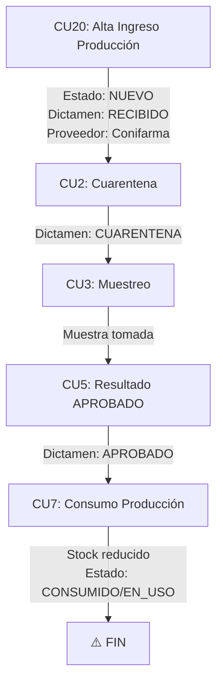

**Descripción:**

1. **CU20 (Ingreso Producción)** `[dictamen: RECIBIDO, proveedor: Conifarma]`
   - **Siguiente permitido:**
     - ✅ CU2 (Cuarentena) - **Típico** para análisis
     - ✅ CU7 (Consumo) - **Solo si dictamen APROBADO** (de análisis previo)
     - ✅ CU28 (Ajuste) - Correcciones
     - ✅ CU29 (Reverso) - Anular ingreso

2. **CU7 (Consumo Producción)** `[requiere dictamen: APROBADO]`
   - **Siguiente permitido:**
     - ✅ CU29 (Reverso) - Anular consumo si no hay dependencias
     - ⚠️ **FIN** - Si stock = 0

---

### Flujo 3: Devolución al Proveedor

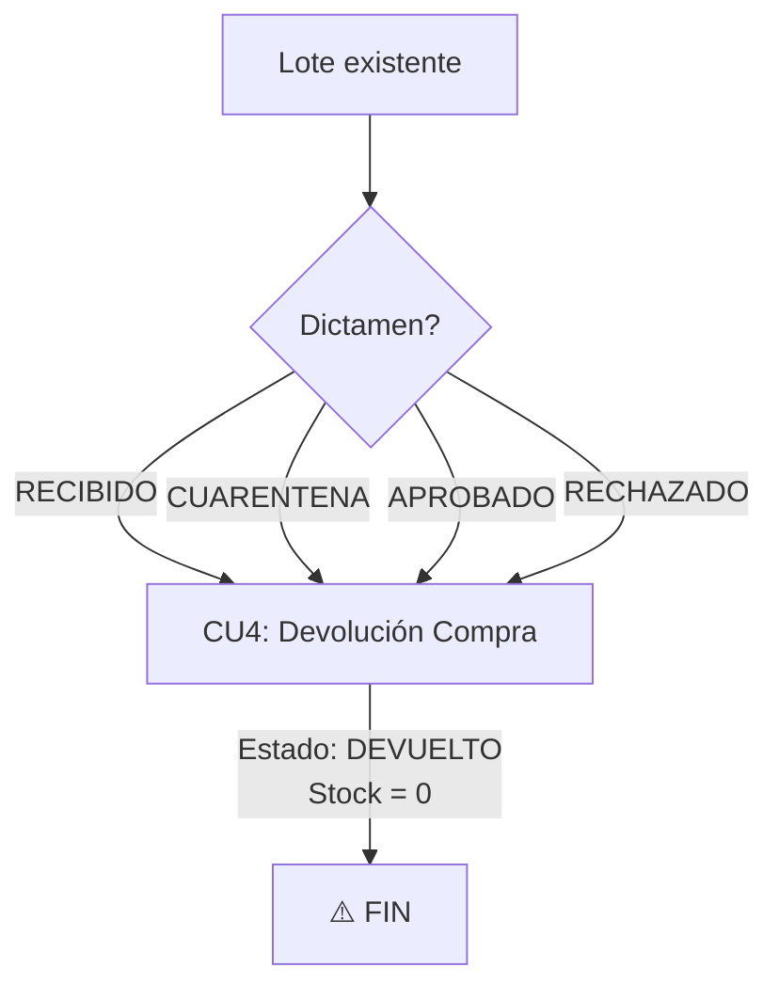

**Descripción:**

1. **CU4 (Devolución Compra)** `[aplica a cualquier dictamen excepto terminales]`
   - **Siguiente permitido:**
     - ✅ CU29 (Reverso) - Restaurar lote
     - ⚠️ **FIN** - Estado terminal

---

## Flujos Principales - Productos Trazados

### Flujo 4: UNIDAD_VENTA con Trazabilidad → Venta

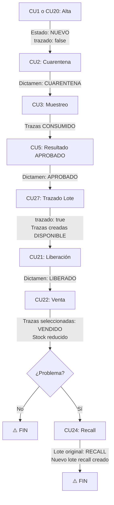

**Descripción paso a paso:**

1. **CU27 (Trazado Lote)** `[requiere: dictamen APROBADO, tipoProducto: UNIDAD_VENTA]`
   - **Pre-condición:** Debe ejecutarse **DESPUÉS** de CU5 (APROBADO) y **ANTES** de CU21 (Liberación)
   - **Efecto:**
     - `lote.trazado = true`
     - Crea trazas numeradas secuencialmente con `estado: DISPONIBLE`
   - **Siguiente permitido:**
     - ✅ CU21 (Liberación) - Continuar flujo normal
     - ✅ CU3 (Muestreo) - Si hay nuevo análisis (CU8)
     - ✅ CU30 (Reverso) - Eliminar trazas

2. **CU22 (Venta)** `[con trazado=true]`
   - **Requiere:** Selección de trazas específicas
   - **Efecto:**
     - Trazas seleccionadas: `estado: VENDIDO`
     - `lote.cantidadActual -= cantidad`
     - `bulto.cantidadActual -= cantidad`
   - **Siguiente permitido:**
     - ✅ CU23 (Devolución Venta) - Con trazas devueltas
     - ✅ CU24 (Recall) - Con trazas a recuperar

3. **CU24 (Recall)** `[requiere CU22 previo con trazas VENDIDO]`
   - **Fase 1 - ALTA (nuevo lote recall):**
     - Código: `{codigoOriginal}_R_{secuencia}`
     - `estado: RECALL`
     - `dictamen: RETIRO_MERCADO`
     - Trazas devueltas reasignadas: `estado: RECALL`
   - **Fase 2 - MODIFICACION (lote original):**
     - `lote.estado: RECALL`
     - `lote.dictamen: RETIRO_MERCADO`
     - Trazas DISPONIBLES restantes: `estado: RECALL`
   - **Siguiente permitido:**
     - ✅ CU28 (Ajuste) - Para destrucción o museo
     - ⛔ CU29/30 (Reverso) - **NO PERMITIDO**

---

### Flujo 5: Devolución de Cliente con Trazas

```mermaid
graph TD
    A[CU22: Venta] -->|Trazas: VENDIDO| B
    B[Cliente devuelve] --> C[CU23: Devolución Venta]
    C -->|Nuevo lote creado<br/>código: {original}_D_{sec}<br/>Estado: DEVUELTO<br/>Dictamen: DEVOLUCION_CLIENTES<br/>Trazas: DEVUELTO| D
    D[CU2: Cuarentena] -->|Reanálisis del lote devuelto<br/>Dictamen: CUARENTENA| E
    E[CU3: Muestreo] --> F
    F[CU5/6: Resultado] --> G{¿Resultado?}
    G -->|APROBADO| H[CU21: Liberación]
    H --> I[CU22: Venta]
    G -->|RECHAZADO| J[CU4: Devolución]
```

**Descripción:**

1. **CU23 (Devolución Venta)** `[requiere CU22 previo]`
   - **Efecto:**
     - Crea **NUEVO LOTE** con código: `{codigoOriginal}_D_{secuencia}`
     - `estado: DEVUELTO`
     - `dictamen: DEVOLUCION_CLIENTES`
     - Trazas devueltas reasignadas: `estado: DEVUELTO`
     - `loteOrigen`: apunta al lote de venta
   - **Siguiente permitido:**
     - ✅ CU2 (Cuarentena) - **Típico** para re-análisis y re-venta
     - ✅ CU4 (Devolución Compra) - Si no es recuperable
     - ✅ CU28 (Ajuste) - Destrucción
     - ✅ CU29 (Reverso) - Anular devolución

---

## Flujos de Contingencia

### Flujo 6: Reanálisis Anticipado

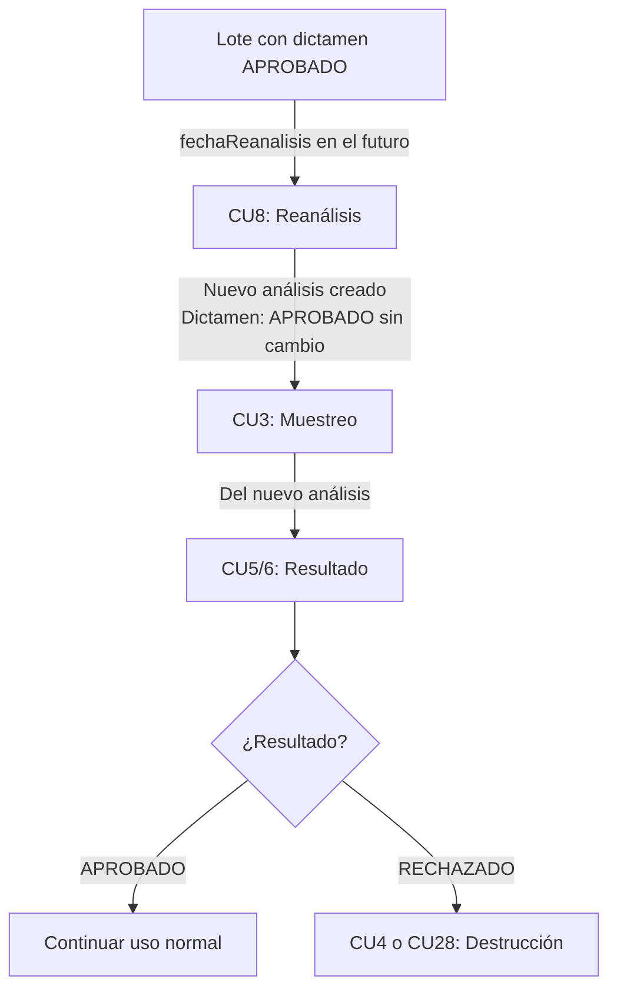

**Descripción:**

1. **CU8 (Reanálisis)** `[requiere dictamen: APROBADO]`
   - **Uso:** Reanálisis anticipado antes de `fechaReanalisis`
   - **Ventaja:** No bloquea el consumo del lote mientras se analiza
   - **Efecto:**
     - Crea nuevo análisis (`activo=true, dictamen=null`)
     - `lote.dictamen` permanece en APROBADO
   - **Siguiente permitido:**
     - ✅ CU3 (Muestreo) - **OBLIGATORIO** del nuevo análisis
     - ✅ CU30 (Reverso) - Anular reanálisis

---

### Flujo 7: Anulación de Análisis en Curso (ANULADO vs CANCELADO)

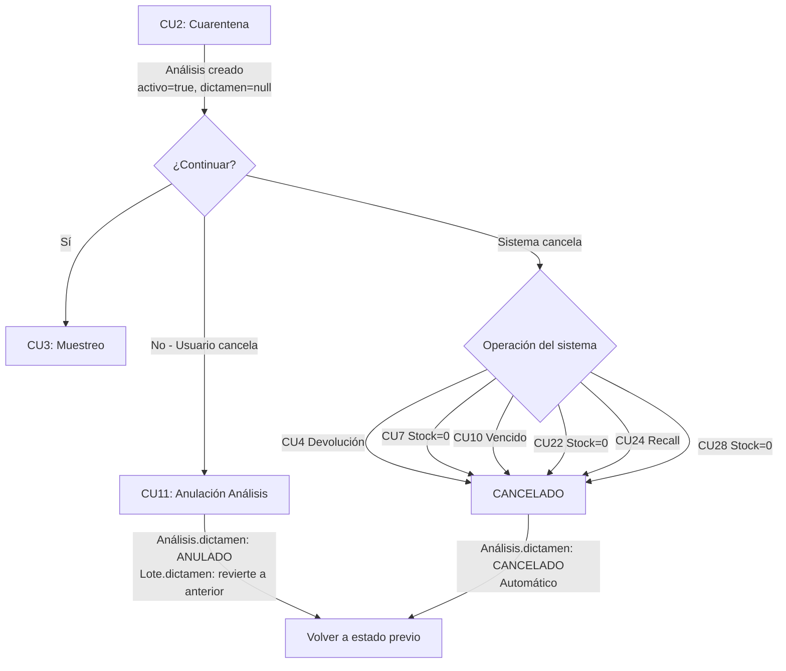

**Descripción:**

1. **CU11 (Anulación Análisis)** `[requiere análisis con dictamen=null]`
   - **Uso:** Usuario cancela manualmente un análisis que aún no tiene resultado
   - **Restricción:** **NO** se puede anular si ya tiene dictamen (APROBADO/RECHAZADO)
   - **Efecto:**
     - `analisis.dictamen: ANULADO` (**cancelación por usuario**)
     - `lote.dictamen`: revierte al dictamen anterior
   - **Siguiente permitido:**
     - ✅ CU2 (Cuarentena) - Iniciar nuevo análisis
     - ✅ Cualquier CU válido según dictamen resultante
     - ✅ CU30 (Reverso) - Restaurar análisis

2. **CANCELADO (Automático)** `[sistema marca cuando análisis es irrelevante]`
   - **Uso:** Sistema cancela automáticamente análisis en curso cuando operaciones posteriores lo hacen imposible/innecesario
   - **Casos:**
     - **CU4 (Devolución)**: Lote devuelto completamente → análisis sin objeto
     - **CU7 (Consumo)**: Stock = 0 → no hay material para analizar
     - **CU10 (Vencimiento)**: Producto vencido → análisis cancelado automáticamente
     - **CU22 (Venta)**: Stock = 0 → no hay material para analizar
     - **CU24 (Recall)**: Lote retirado del mercado → análisis sin sentido
     - **CU28 (Ajuste)**: Stock ajustado a 0 → no hay material para analizar
   - **Reversibilidad:**
     - ✅ Reversible mediante reverso de la operación origen (CU29/CU30)
     - Al reversar: `analisis.dictamen: CANCELADO → null` (vuelve a "en curso")

---

### Flujo 8: Ajuste de Inventario

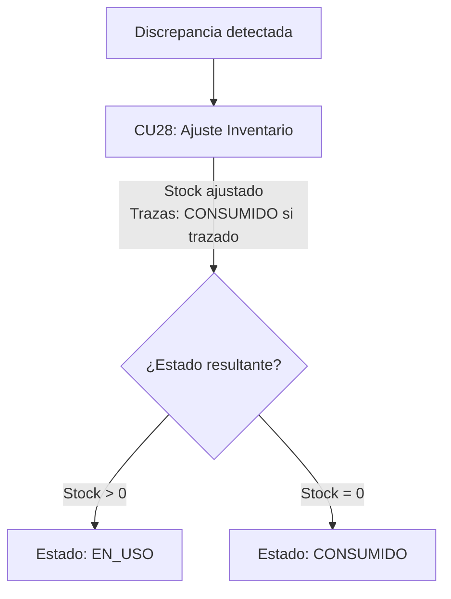

**Descripción:**

1. **CU28 (Ajuste Inventario)** `[aplica a cualquier estado excepto terminales absolutos]`
   - **Uso:**
     - Corrección de mermas/pérdidas
     - Destrucción de producto
     - Museo (conservación de muestras)
   - **Para productos trazados:** Requiere selección de trazas específicas
   - **Siguiente permitido:**
     - ✅ Cualquier CU válido según dictamen y estado resultante
     - ✅ CU29 (Reverso) - **SOLO SI** no hay ajustes derivados posteriores

---

## Flujos Automáticos

### Flujo 9: Expiración de Análisis (CU9) 🤖

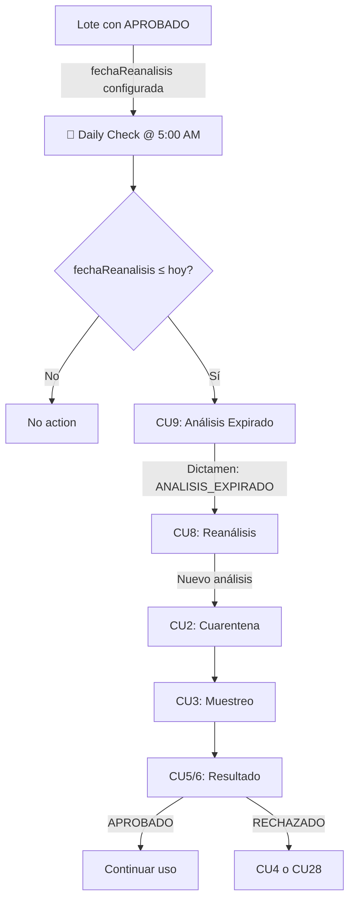

**Descripción:**

1. **CU9 (Análisis Expirado)** 🤖 `[automático @ 5:00 AM]`
   - **Trigger:** `lote.fechaReanalisisVigente ≤ LocalDate.now()`
   - **Efecto:** `lote.dictamen: ANALISIS_EXPIRADO`
   - **Siguiente permitido:**
     - ✅ CU2 (Cuarentena) - Asociar nuevo análisis
     - ✅ CU3 (Muestreo) → CU5/6 (Resultado) - Completar reanálisis
     - ⛔ CU22 (Venta) - **BLOQUEADO** hasta re-aprobar

---

### Flujo 10: Vencimiento de Producto (CU10) 🤖

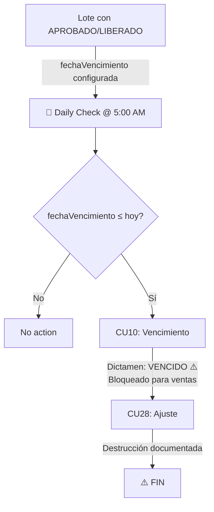

**Descripción:**

1. **CU10 (Vencimiento Producto)** 🤖 `[automático @ 5:00 AM]`
   - **Trigger:** `lote.fechaVencimientoVigente ≤ LocalDate.now()`
   - **Efecto:** `lote.dictamen: VENCIDO` ⚠️
   - **Estado:** Terminal para ventas
   - **Siguiente permitido:**
     - ✅ CU28 (Ajuste) - **ÚNICO** permitido para destrucción
     - ⛔ CU22 (Venta) - **BLOQUEADO** permanentemente
     - ⛔ CU7 (Consumo) - **BLOQUEADO**
     - ⛔ CU29/30 (Reverso) - **NO PERMITIDO** (es automático)

---

## Reversos y Restricciones

### CU29/30/31: Reverso de Movimientos

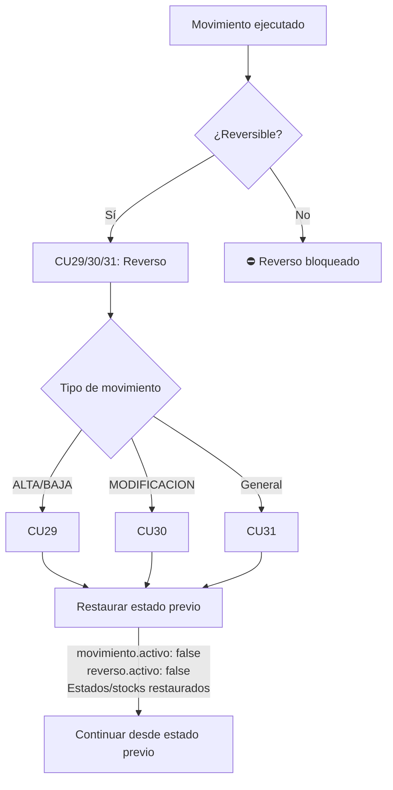

### Tabla de Reversibilidad

| CU Original | Reversible | Restricciones |
|-------------|------------|---------------|
| **CU1** (Alta Compra) | 🔄 CU29 | ⛔ Si hay movimientos posteriores |
| **CU2** (Cuarentena) | 🔄 CU30 | ⛔ Si ya hay CU3 (Muestreo) |
| **CU3** (Muestreo) | 🔄 CU29 | ⛔ Si ya hay CU5/6 (Resultado) |
| **CU4** (Devolución Compra) | 🔄 CU29 | ✅ Siempre reversible |
| **CU5/6** (Resultado) | 🔄 CU30 | ⛔ Si ya hay CU21 (Liberación) o CU7 (Consumo) |
| **CU7** (Consumo) | 🔄 CU29 | ⛔ Si hay CU20 (Producción) derivada |
| **CU8** (Reanálisis) | 🔄 CU30 | ⛔ Si ya hay CU3 del nuevo análisis |
| **CU9** (Análisis Expirado) | ⛔ No | Automático, controlado por fechas - **NO REVERSIBLE** |
| **CU10** (Vencimiento) | ⛔ No | Automático, controlado por fechas - **NO REVERSIBLE** |
| **CU11** (Anulación) | 🔄 CU30 | ✅ Siempre reversible |
| **CU20** (Ingreso Producción) | 🔄 CU29 | ⛔ Si hay movimientos posteriores |
| **CU21** (Liberación) | 🔄 CU30 | ⛔ Si ya hay CU22 (Venta) |
| **CU22** (Venta) | 🔄 CU29 | ⛔ Si hay CU23 (Devolución) o CU24 (Recall) |
| **CU23** (Devolución Venta) | 🔄 CU29 | ⛔ Si el lote devuelto ya tiene movimientos |
| **CU24** (Recall) | ⛔ No | Irreversible por implicaciones regulatorias |
| **CU27** (Trazado) | 🔄 CU30 | ⛔ Si hay ventas con trazas |
| **CU28** (Ajuste) | 🔄 CU29 | ⛔ Si hay ajustes derivados posteriores |

---

## Diagramas Mermaid Completos

### Diagrama 1: Flujo Completo - Compra Externa (NO Trazado)

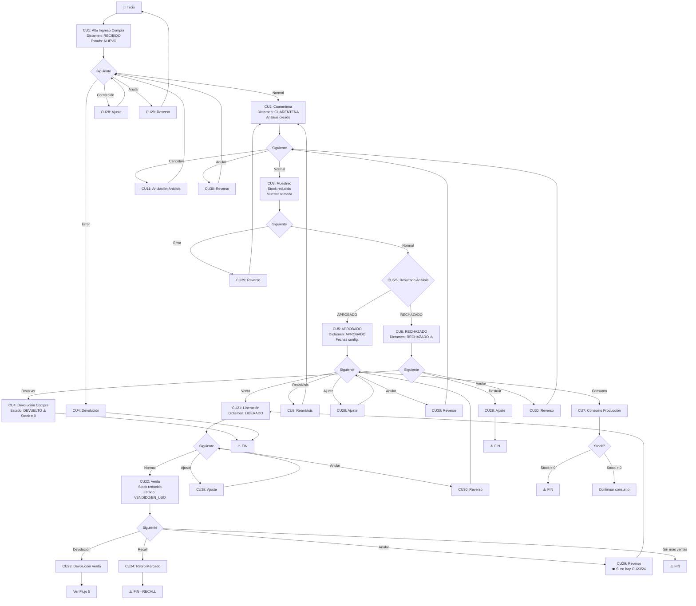

### Diagrama 2: Flujo Completo - UNIDAD_VENTA Trazada

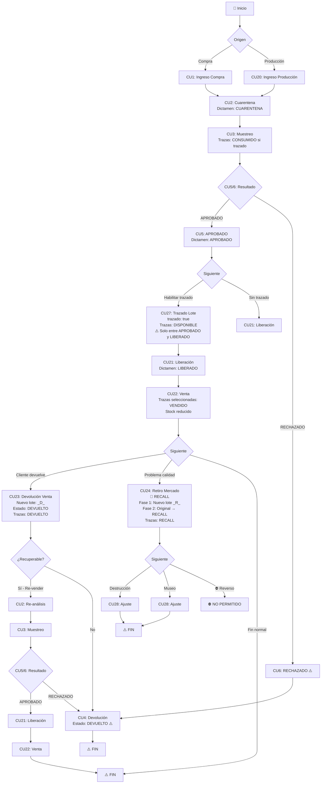

### Diagrama 3: Flujos Automáticos (CU9 y CU10)

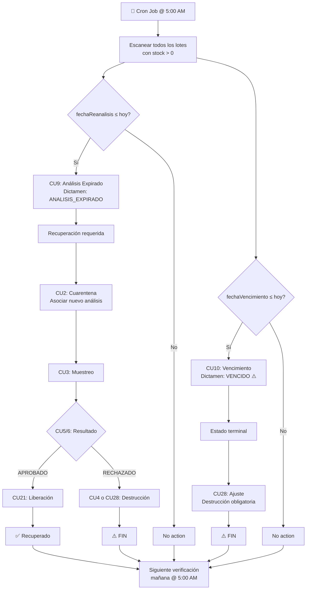

### Diagrama 4: Matriz de Transiciones Válidas

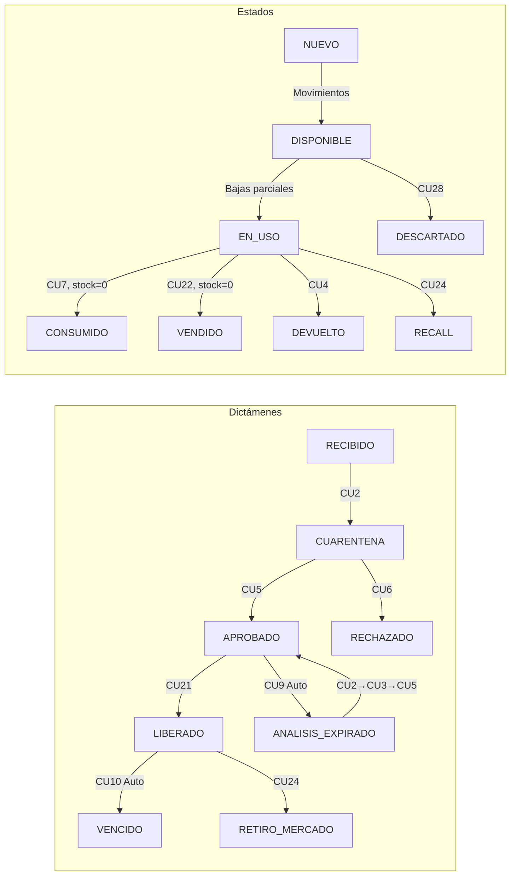

---

## Resumen de Restricciones Críticas

### 1. Secuencias Obligatorias

| Secuencia | Razón |
|-----------|-------|
| **CU2 → CU3 → CU5/6** | No se puede dictaminar sin muestreo |
| **CU5(APROBADO) → CU21** | Regulatorio: aprobación previa a liberación |
| **CU27 (entre CU5 y CU21)** | Trazado solo después de aprobación y antes de liberación |
| **CU9 → CU2 → CU3 → CU5/6** | Recuperación de análisis expirado |

### 2. CU Bloqueados por Dictamen

| Dictamen | CU Bloqueados |
|----------|---------------|
| **RECIBIDO** | CU3, CU5/6, CU7, CU21, CU22 |
| **CUARENTENA** | CU5/6 (sin CU3), CU7, CU21, CU22 |
| **APROBADO** | CU22 (requiere CU21 primero) |
| **RECHAZADO** | CU3, CU5/6, CU7, CU21, CU22 (solo CU4 o CU28) |
| **ANALISIS_EXPIRADO** | CU7, CU21, CU22 (requiere CU2→CU3→CU5 primero) |
| **VENCIDO** | CU3, CU5/6, CU7, CU21, CU22 (solo CU28) |
| **LIBERADO** | - (permite ventas) |
| **RETIRO_MERCADO** | CU3, CU5/6, CU7, CU21, CU22 (solo CU28) |

### 3. CU Bloqueados por Estado

| Estado | CU Bloqueados |
|--------|---------------|
| **CONSUMIDO** | Todos (solo CU29 reverso) |
| **VENDIDO** | Todos (excepto CU23, CU24, CU29) |
| **DEVUELTO** | Todos (solo CU29 reverso) |
| **RECALL** | Todos (solo CU28 ajuste) |
| **DESCARTADO** | Todos (terminal absoluto) |

### 4. Reversos Bloqueados

| Situación | Razón |
|-----------|-------|
| **CU22 con CU23/24 posterior** | Afecta devoluciones/recalls |
| **CU24 procesado** | Implicaciones regulatorias |
| **CU9/CU10 automáticos** | Controlados por fechas |
| **CU7 con CU20 derivado** | Afecta producción posterior |
| **CU29 de CU28 con ajustes derivados** | Cadena de ajustes |

### 5. Restauración de Análisis CANCELADO

Cuando se reversa una operación que marcó un análisis como CANCELADO, el reverso **restaura el análisis a estado "en curso"** (`dictamen: null`):

| CU Reversado | Efecto en Análisis CANCELADO | Observaciones |
|--------------|------------------------------|---------------|
| **CU4** (Devolución) | `CANCELADO → null` (en curso) | CU29 restaura el lote y el análisis |
| **CU7** (Consumo) | `CANCELADO → null` (en curso) | CU29 restaura stock y análisis si fue cancelado |
| **CU22** (Venta) | `CANCELADO → null` (en curso) | CU29 restaura stock y análisis si fue cancelado |
| **CU24** (Recall) | `CANCELADO → null` (en curso) | CU29 restaura estado y análisis |
| **CU28** (Ajuste) | `CANCELADO → null` (en curso) | CU29 restaura stock y análisis si fue cancelado |

**Importante:**
- La restauración **solo aplica si el análisis fue marcado CANCELADO por esa operación específica**
- El análisis vuelve a estar "en curso" (`activo=true, dictamen=null`)
- El usuario puede continuar con **CU3 (Muestreo) → CU5/6 (Resultado)**
- **CU10 (Vencimiento)** NO es reversible, por lo tanto su CANCELADO tampoco se restaura

---

## Casos de Uso Especiales

### Caso 1: Producto aprobado próximo a expirar (CU8)

**Escenario:** Lote APROBADO, falta 1 mes para `fechaReanalisis`

**Flujo:**
1. Se ejecuta **CU8 (Reanálisis)** anticipadamente
2. El lote **permanece en APROBADO** (no pasa a CUARENTENA)
3. Se puede seguir usando para **CU7 (Consumo)** o **CU22 (Venta)**
4. Paralelamente: CU3 (Muestreo del nuevo análisis) → CU5/6 (Resultado)
5. Si CU5 (APROBADO): se actualizan fechas
6. Si CU6 (RECHAZADO): se bloquea el lote

**Ventaja:** No interrumpe el uso del producto mientras se re-analiza

### Caso 2: Recall parcial con trazabilidad

**Escenario:** Se vendieron 1000 unidades, solo 50 están defectuosas

**Flujo:**
1. CU24 (Recall) seleccionando **solo las 50 trazas defectuosas**
2. Nuevo lote recall: 50 unidades (estado RECALL)
3. Lote original: resto de trazas DISPONIBLES → RECALL también (precaución)
4. Recuperación: las 50 trazas devueltas

**Ventaja:** Precisión en el recall, minimiza impacto

### Caso 3: Devolución de cliente → Re-venta

**Escenario:** Cliente devuelve producto en buen estado

**Flujo:**
1. CU23 (Devolución Venta) → Nuevo lote con estado DEVUELTO
2. CU2 (Cuarentena) → Re-análisis del lote devuelto
3. CU3 (Muestreo) → CU5 (APROBADO)
4. CU21 (Liberación) → CU22 (Venta)

**Ventaja:** Recuperación de producto devuelto

---

## Documento de Referencia

**Fuentes:**
- `RELEVAMIENTO SISTEMA STOCK.md` - Especificación de diseño
- Código fuente: `com.mb.conitrack.service.cu.*`
- Análisis exhaustivo de validaciones

**Mantenimiento:**
- Actualizar este documento cuando se agreguen nuevos CU
- Validar flujos con stakeholders de negocio
- Sincronizar con guía de usuario

---

*Fin del documento - CU_TREE_BUSINESS_LOGIC.md v2.0*
