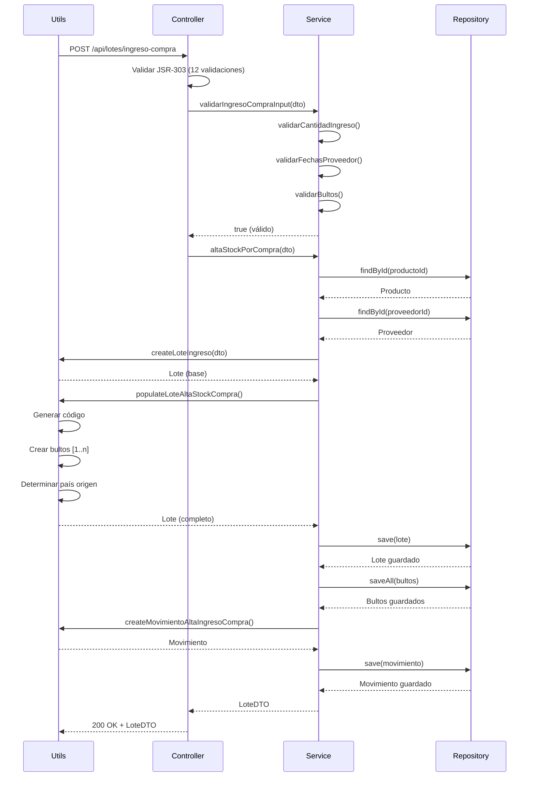
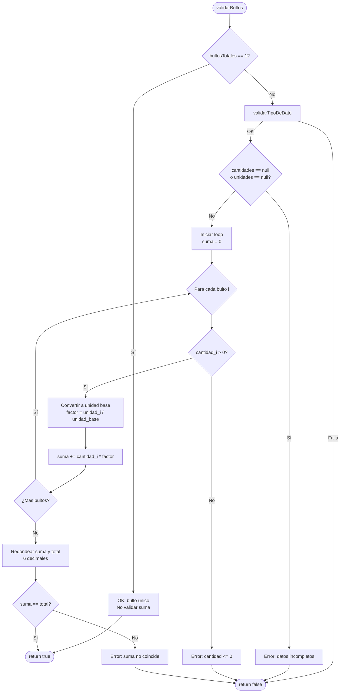
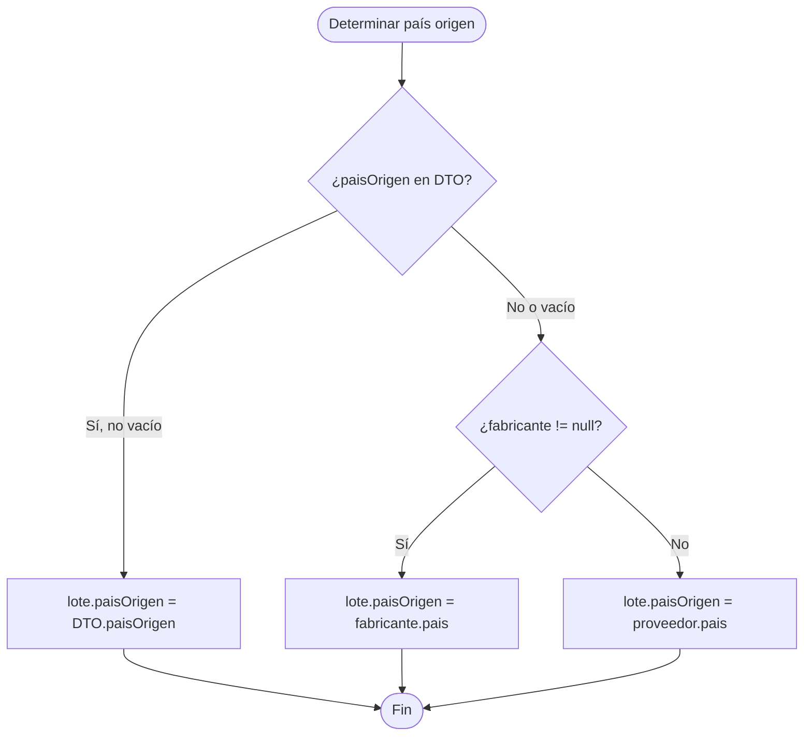

# CU1 - ALTA INGRESO COMPRA

**Versión:** 1.0
**Fecha:** 2025-11-01
**Sistema:** CONITRACK - Gestión de Stock Farmacéutico
**Tipo Operación:** ALTA
**Motivo:** COMPRA

---

## Tabla de Contenidos

1. [Descripción General](#descripción-general)
2. [Actores](#actores)
3. [Pre-condiciones](#pre-condiciones)
4. [Flujo Principal](#flujo-principal)
5. [Validaciones](#validaciones)
6. [Generación Automática](#generación-automática)
7. [Reglas de Negocio](#reglas-de-negocio)
8. [Post-condiciones](#post-condiciones)
9. [Casos de Uso](#casos-de-uso)
10. [Componentes Técnicos](#componentes-técnicos)
11. [Tests](#tests)
12. [Diagrama de Flujo](#diagrama-de-flujo)
13. [Ejemplos de Datos](#ejemplos-de-datos)

---

## Descripción General

El CU1 - Alta Ingreso Compra es el caso de uso que **inicia el ciclo de vida de un lote de producto externo** recibido desde un proveedor (NO Conifarma).

Este caso de uso:
- Crea un nuevo **Lote** con estado NUEVO y dictamen RECIBIDO
- Genera el **código de lote** único con formato `L-{codigoProducto}-{timestamp}`
- Crea los **Bultos** asociados al lote (de 1 a n)
- Registra el **Movimiento** de tipo ALTA con motivo COMPRA
- Vincula el lote con **Producto**, **Proveedor** y **Fabricante** (opcional)
- Aplica **15 validaciones** antes de persistir en base de datos

**Contexto de negocio:** Este CU se ejecuta cuando llegan materiales (APIs, excipientes, acondicionamiento) desde proveedores externos. El lote queda en estado RECIBIDO esperando ser enviado a Cuarentena (CU2) para análisis de Control de Calidad.

---

## Actores

| Rol | Descripción | Permisos |
|-----|-------------|----------|
| **Analista de Planta** | Usuario operativo que registra la recepción de materiales | Ejecutar CU1, CU2, CU28 |

---

## Pre-condiciones

### 1. Producto Debe Existir

El producto debe estar registrado en el sistema con los siguientes requisitos:

- **Tipo de producto permitido:**
  - `API` (Ingrediente Farmacéutico Activo)
  - `EXCIPIENTE`
  - `ACOND_PRIMARIO` (Acondicionamiento primario)
  - `ACOND_SECUNDARIO` (Acondicionamiento secundario)

- **Tipo de producto NO permitido:**
  - `SEMIELABORADO` (se crea con CU20 - Ingreso Producción)
  - `UNIDAD_VENTA` (se crea con CU20 - Ingreso Producción)

- **Campos requeridos en Producto:**
  - `codigoProducto`: Código único (ej: "API-001")
  - `nombreGenerico`: Nombre del producto
  - `unidadMedida`: Unidad de medida base (KILOGRAMO, GRAMO, LITRO, MILILITRO, UNIDAD)
  - `activo`: true

### 2. Proveedor Debe Existir

El proveedor debe estar registrado en el sistema:

- **Restricción crítica:** El proveedor **NO puede ser Conifarma**
  - Conifarma es el proveedor interno (usado en CU20)
  - Validación: `proveedor.razonSocial != "Conifarma"`

- **Campos requeridos en Proveedor:**
  - `razonSocial`: Nombre del proveedor
  - `pais`: País de origen (usado para determinar paisOrigen del lote)
  - `activo`: true

### 3. Fabricante (Opcional)

- El fabricante es **opcional**
- Si se proporciona, también debe ser un Proveedor registrado
- **NO puede ser Conifarma**
- Se usa para determinar el país de origen con mayor prioridad

### 4. Flujos Alternativos

Si no se cumplen las pre-condiciones:

**Producto NO existe:**
- Escalar a **Gerencia Calidad**
- Ejecutar alta de producto (fuera del sistema)
- Reiniciar CU1

**Proveedor NO existe:**
- Escalar a **Supervisor/Analista de Planta**
- Ejecutar alta de proveedor (fuera del sistema)
- Reiniciar CU1

---

## Flujo Principal

### Paso 1: Carga de Datos

El usuario completa el formulario con los siguientes campos:

| Campo | Tipo | Obligatorio | Validación | Default |
|-------|------|-------------|------------|---------|
| **productoId** | Long | ✅ | Producto existe y tipo válido | - |
| **proveedorId** | Long | ✅ | Proveedor existe y NO Conifarma | - |
| **fabricanteId** | Long | ❌ | Si existe, NO Conifarma | - |
| **cantidadInicial** | BigDecimal | ✅ | > 0, entero si UNIDAD, >= bultos | - |
| **unidadMedida** | UnidadMedidaEnum | ✅ | Compatible con producto | unidad del producto |
| **bultosTotales** | Integer | ✅ | >= 1 | 1 |
| **cantidadesBultos** | List<BigDecimal> | Condicional | Si bultos > 1: suma = total ± 0.000001 | - |
| **unidadMedidaBultos** | List<UnidadMedidaEnum> | Condicional | Si bultos > 1: convertibles entre sí | - |
| **loteProveedor** | String | ✅ | No vacío | - |
| **fechaIngreso** | LocalDate | ✅ | <= hoy | hoy |
| **fechaReanalisisProveedor** | LocalDate | ❌ | Si existe vencimiento: < vencimiento | - |
| **fechaVencimientoProveedor** | LocalDate | ❌ | Si existe reanálisis: > reanálisis | - |
| **paisOrigen** | String | ❌ | País válido | fabricante.pais o proveedor.pais |
| **nroRemito** | String | ❌ | Max 30 caracteres | - |
| **detalleConservacion** | String | ❌ | Texto libre | - |
| **observaciones** | String | ❌ | Max 300 caracteres | - |

### Paso 2: Validación de Entrada

El sistema ejecuta `validarIngresoCompraInput(dto, bindingResult)`:

1. Valida anotaciones JSR-303 del DTO
2. Ejecuta `validarCantidadIngreso()` - Ver [Validaciones](#validaciones)
3. Ejecuta `validarFechasProveedor()` - Ver [Validaciones](#validaciones)
4. Ejecuta `validarBultos()` - Ver [Validaciones](#validaciones)

Si alguna validación falla: **rechaza la operación** y retorna errores al usuario.

### Paso 3: Construcción de Entidades

El sistema ejecuta `altaStockPorCompra(loteDTO)`:

1. **Recupera entidades relacionadas:**
   ```java
   Proveedor proveedor = proveedorRepository.findById(loteDTO.getProveedorId())
       .orElseThrow(() -> new IllegalArgumentException("El proveedor no existe."));

   Producto producto = productoRepository.findById(loteDTO.getProductoId())
       .orElseThrow(() -> new IllegalArgumentException("El producto no existe."));

   Optional<Proveedor> fabricante = loteDTO.getFabricanteId() != null
       ? proveedorRepository.findById(loteDTO.getFabricanteId())
       : Optional.empty();
   ```

2. **Crea el Lote:**
   ```java
   Lote lote = LoteEntityUtils.createLoteIngreso(loteDTO);
   LoteEntityUtils.populateLoteAltaStockCompra(lote, loteDTO, producto, proveedor, fabricante.orElse(null));
   ```
   - Estado: NUEVO
   - Dictamen: RECIBIDO
   - Código: `L-{codigoProducto}-{timestamp}`
   - CantidadInicial = CantidadActual
   - Activo: true

3. **Crea los Bultos:**
   ```java
   for (int i = 0; i < bultosTotales; i++) {
       Bulto bulto = new Bulto();
       bulto.setNroBulto(i + 1);
       bulto.setEstado(EstadoEnum.NUEVO);
       bulto.setCantidadInicial(cantidadesBultos.get(i));
       bulto.setCantidadActual(cantidadesBultos.get(i));
       bulto.setUnidadMedida(unidadMedidaBultos.get(i));
       bulto.setLote(lote);
       lote.getBultos().add(bulto);
   }
   ```

4. **Determina País de Origen:**
   - Prioridad 1: `loteDTO.paisOrigen` (si no está vacío)
   - Prioridad 2: `fabricante.pais` (si existe fabricante)
   - Prioridad 3: `proveedor.pais`

### Paso 4: Persistencia Transaccional

El sistema persiste en el siguiente orden:

1. **Lote:**
   ```java
   Lote loteGuardado = loteRepository.save(lote);
   ```

2. **Bultos:**
   ```java
   bultoRepository.saveAll(loteGuardado.getBultos());
   ```

3. **Movimiento:**
   ```java
   Movimiento movimiento = MovimientoAltaUtils.createMovimientoAltaIngresoCompra(loteGuardado);
   MovimientoAltaUtils.addLoteInfoToMovimientoAlta(loteGuardado, movimiento);
   movimientoRepository.save(movimiento);
   ```
   - Tipo: ALTA
   - Motivo: COMPRA
   - Cantidad: cantidadInicial
   - Activo: true
   - Código: `{codigoLote}_MOV_{timestamp}`

4. **DetalleMovimiento:**
   - Uno por cada bulto
   - Vinculado bidireccionalmente: `bulto <-> detalleMovimiento <-> movimiento`

### Paso 5: Retorno

El sistema retorna `LoteDTO` con:
- Código generado
- Estado y dictamen
- Bultos creados
- Movimiento asociado

---

## Validaciones

### Tabla Completa de Validaciones (15 total)

| # | Tipo | Validación | Campo | Condición | Mensaje de Error |
|---|------|-----------|-------|-----------|------------------|
| 1 | JSR-303 | @NotNull | productoId | != null | "El producto es obligatorio" |
| 2 | JSR-303 | @NotNull | proveedorId | != null | "El proveedor es obligatorio" |
| 3 | JSR-303 | @NotNull | cantidadInicial | != null | "La cantidad es obligatoria" |
| 4 | JSR-303 | @Positive | cantidadInicial | > 0 | "La cantidad debe ser mayor a 0" |
| 5 | JSR-303 | @NotNull | unidadMedida | != null | "La unidad de medida es obligatoria" |
| 6 | JSR-303 | @NotNull | loteProveedor | != null | "El lote proveedor es obligatorio" |
| 7 | JSR-303 | @Size(max=30) | nroRemito | length <= 30 | "El nro de remito no puede exceder 30 caracteres" |
| 8 | JSR-303 | @Size(max=300) | observaciones | length <= 300 | "Las observaciones no pueden exceder 300 caracteres" |
| 9 | JSR-303 | @NotNull | fechaIngreso | != null | "La fecha de ingreso es obligatoria" |
| 10 | JSR-303 | @Min(1) | bultosTotales | >= 1 | "Debe haber al menos 1 bulto" |
| 11 | JSR-303 | @PastOrPresent | fechaIngreso | <= hoy | "La fecha de ingreso no puede ser futura" |
| 12 | JSR-303 | @Future | fechaVencimientoProveedor | > hoy | "La fecha de vencimiento debe ser futura" |
| 13 | Custom | validarCantidadIngreso | cantidadInicial | Si UNIDAD: entero y >= bultos | "La cantidad debe ser un número entero positivo cuando la unidad es UNIDAD" |
| 14 | Custom | validarFechasProveedor | fechaReanalisisProveedor | Si ambas existen: reanalisis < vencimiento | "La fecha de reanálisis no puede ser posterior a la fecha de vencimiento" |
| 15 | Custom | validarBultos | cantidadesBultos | Si bultos > 1: suma convertida = total ± 0.000001 | "La suma de las cantidades individuales no coincide con la cantidad total" |

### Validación 13 Detallada: Cantidad UNIDAD

**Código:**
```java
if (UnidadMedidaEnum.UNIDAD.equals(loteDTO.getUnidadMedida())) {
    // 13.1: Debe ser entero
    if (cantidad.stripTrailingZeros().scale() > 0) {
        bindingResult.rejectValue("cantidadInicial", "error.cantidadInicial",
            "La cantidad debe ser un número entero positivo cuando la unidad es UNIDAD.");
        return false;
    }
    // 13.2: Debe ser >= bultos totales
    if (cantidad.compareTo(new BigDecimal(loteDTO.getBultosTotales())) < 0) {
        bindingResult.rejectValue("bultosTotales", "error.bultosTotales",
            "La cantidad de Unidades (" + cantidad + ") no puede ser menor a la cantidad de Bultos totales: " + loteDTO.getBultosTotales());
        return false;
    }
}
```

**Ejemplos:**
- ✅ Válido: cantidad=10 UNIDAD, bultos=3 (10 >= 3, es entero)
- ❌ Inválido: cantidad=10.5 UNIDAD (no es entero)
- ❌ Inválido: cantidad=2 UNIDAD, bultos=5 (2 < 5)

### Validación 14 Detallada: Fechas Proveedor

**Código:**
```java
if (loteDTO.getFechaReanalisisProveedor() != null &&
    loteDTO.getFechaVencimientoProveedor() != null) {
    if (loteDTO.getFechaReanalisisProveedor().isAfter(loteDTO.getFechaVencimientoProveedor())) {
        bindingResult.rejectValue("fechaReanalisisProveedor", "",
            "La fecha de reanálisis no puede ser posterior a la fecha de vencimiento.");
        return false;
    }
}
```

**Ejemplos:**
- ✅ Válido: reanalisis=2026-07-15, vencimiento=2028-01-15
- ❌ Inválido: reanalisis=2028-07-15, vencimiento=2028-01-15

### Validación 15 Detallada: Suma de Bultos

**Código:**
```java
BigDecimal sumaConvertida = BigDecimal.ZERO;
for (int i = 0; i < cantidades.size(); i++) {
    BigDecimal cantidad = cantidades.get(i);
    UnidadMedidaEnum unidadBulto = unidades.get(i);
    double factor = unidadBulto.getFactorConversion() / unidadBase.getFactorConversion();
    BigDecimal cantidadConvertida = cantidad.multiply(BigDecimal.valueOf(factor));
    sumaConvertida = sumaConvertida.add(cantidadConvertida);
}

BigDecimal sumaRedondeada = sumaConvertida.setScale(6, RoundingMode.HALF_UP);
BigDecimal totalEsperado = loteDTO.getCantidadInicial().setScale(6, RoundingMode.HALF_UP);

if (sumaRedondeada.compareTo(totalEsperado) != 0) {
    // Error
}
```

**Tolerancia:** 6 decimales (0.000001)

**Ejemplos:**
- ✅ Válido: Total=1.5 KG, Bultos=[1.0 KG, 500 GRAMO] → 1.0 + 0.5 = 1.5
- ❌ Inválido: Total=30.0 KG, Bultos=[10.0 KG, 15.0 KG] → 10.0 + 15.0 = 25.0 ≠ 30.0

---

## Generación Automática

### 1. Código de Lote

**Formato:** `L-{codigoProducto}-{timestamp}`

**Timestamp:** `yy.MM.dd_HH.mm.ss`

**Código:**
```java
lote.setCodigoLote("L-" +
    producto.getCodigoProducto() +
    "-" +
    loteDTO.getFechaYHoraCreacion().format(DateTimeFormatter.ofPattern("yy.MM.dd_HH.mm.ss")));
```

**Ejemplos:**
- `L-API-001-25.01.15_10.30.45`
- `L-EXC-045-25.02.20_14.15.30`
- `L-ACOND-012-25.03.10_09.00.00`

### 2. Estado y Dictamen

**Automático:**
- `lote.estado = EstadoEnum.NUEVO`
- `lote.dictamen = DictamenEnum.RECIBIDO`
- `lote.activo = true`

### 3. Bultos

**Numeración secuencial:** `[1..n]`

**Código:**
```java
for (int i = 0; i < bultosTotales; i++) {
    bulto.setNroBulto(i + 1); // 1, 2, 3, ...
    bulto.setEstado(EstadoEnum.NUEVO);
    bulto.setActivo(true);
}
```

### 4. Movimiento

**Código:** `{codigoLote}_MOV_{timestamp}`

**Automático:**
- `movimiento.tipoMovimiento = TipoMovimientoEnum.ALTA`
- `movimiento.motivo = MotivoEnum.COMPRA`
- `movimiento.activo = true`
- `movimiento.cantidad = lote.cantidadInicial`

### 5. DetalleMovimiento

**Uno por bulto:**
```java
for (Bulto bulto : lote.getBultos()) {
    DetalleMovimiento detalle = new DetalleMovimiento();
    detalle.setBulto(bulto);
    detalle.setMovimiento(movimiento);
    detalle.setCantidad(bulto.cantidadInicial);
    movimiento.getDetalles().add(detalle);
}
```

---

## Reglas de Negocio

### RN1: País de Origen (Prioridad en Cascada)

**Lógica:**
```java
if (!StringUtils.isEmptyOrWhitespace(loteDTO.getPaisOrigen())) {
    lote.setPaisOrigen(loteDTO.getPaisOrigen()); // Prioridad 1: DTO
} else if (fabricante != null) {
    lote.setPaisOrigen(fabricante.getPais()); // Prioridad 2: Fabricante
} else {
    lote.setPaisOrigen(proveedor.getPais()); // Prioridad 3: Proveedor
}
```

**Casos:**
- DTO="China", Fabricante="Alemania", Proveedor="Argentina" → **"China"**
- DTO=vacío, Fabricante="Alemania", Proveedor="Argentina" → **"Alemania"**
- DTO=vacío, Fabricante=null, Proveedor="Argentina" → **"Argentina"**

### RN2: Bulto Único vs Múltiples

**Bulto único (bultosTotales = 1):**
```java
if (bultosTotales == 1) {
    bulto.setCantidadInicial(loteDTO.getCantidadInicial());
    bulto.setUnidadMedida(loteDTO.getUnidadMedida());
}
```
- Toda la cantidad va al único bulto
- No se valida suma de bultos (no hay arreglos)

**Múltiples bultos (bultosTotales > 1):**
```java
for (int i = 0; i < bultosTotales; i++) {
    bulto.setCantidadInicial(loteDTO.getCantidadesBultos().get(i));
    bulto.setUnidadMedida(loteDTO.getUnidadMedidaBultos().get(i));
}
```
- Requiere arreglos `cantidadesBultos` y `unidadMedidaBultos`
- Valida suma convertida = total

### RN3: Unidad UNIDAD (Restricciones Especiales)

**Restricciones:**
1. **Cantidad debe ser entero:**
   ```java
   cantidad.stripTrailingZeros().scale() > 0 → ERROR
   ```

2. **Cantidad >= bultos totales:**
   ```java
   cantidad < bultosTotales → ERROR
   ```

**Justificación:** UNIDAD representa unidades indivisibles (frascos, ampollas, etc.)

### RN4: Conversiones de Unidades

**Sistema de conversión:**
- Tipos: PESO, VOLUMEN, UNIDAD
- Cada tipo tiene factor de conversión base

**Ejemplo PESO:**
- KILOGRAMO: factor = 1000.0
- GRAMO: factor = 1.0
- Conversión: `cantidad * (factorOrigen / factorDestino)`

**Código:**
```java
double factor = unidadBulto.getFactorConversion() / unidadBase.getFactorConversion();
BigDecimal cantidadConvertida = cantidad.multiply(BigDecimal.valueOf(factor));
```

**Ejemplo:**
- 500 GRAMO → ? KILOGRAMO
- factor = 1.0 / 1000.0 = 0.001
- cantidadConvertida = 500 * 0.001 = 0.5 KG

### RN5: Tolerancia de Conversión

**Tolerancia:** 6 decimales (0.000001)

**Justificación:** Evitar errores de redondeo en operaciones con BigDecimal

**Código:**
```java
sumaConvertida.setScale(6, RoundingMode.HALF_UP)
totalEsperado.setScale(6, RoundingMode.HALF_UP)
```

---

## Post-condiciones

### 1. Lote Creado

**Estado final:**
```json
{
  "id": 123,
  "codigoLote": "L-API-001-25.01.15_10.30.45",
  "estado": "NUEVO",
  "dictamen": "RECIBIDO",
  "activo": true,
  "cantidadInicial": 100.0,
  "cantidadActual": 100.0,
  "unidadMedida": "KILOGRAMO",
  "bultosTotales": 3,
  "trazado": false,
  "paisOrigen": "Alemania"
}
```

### 2. Bultos Creados

**Estado final (cada bulto):**
```json
{
  "id": 456,
  "nroBulto": 1,
  "estado": "NUEVO",
  "activo": true,
  "cantidadInicial": 50.0,
  "cantidadActual": 50.0,
  "unidadMedida": "KILOGRAMO",
  "lote": { "id": 123 }
}
```

### 3. Movimiento Creado

**Estado final:**
```json
{
  "id": 789,
  "codigoMovimiento": "L-API-001-25.01.15_10.30.45_MOV_25.01.15_10.30.45",
  "tipoMovimiento": "ALTA",
  "motivo": "COMPRA",
  "activo": true,
  "cantidad": 100.0,
  "unidadMedida": "KILOGRAMO",
  "fecha": "2025-01-15",
  "lote": { "id": 123 }
}
```

### 4. DetalleMovimiento

**Uno por bulto:**
```json
{
  "id": 101,
  "cantidad": 50.0,
  "bulto": { "id": 456, "nroBulto": 1 },
  "movimiento": { "id": 789 }
}
```

### 5. Inventario Actualizado

- **Stock inicial = Stock actual:** cantidadInicial = cantidadActual
- **No hay trazas:** trazado = false (se crea con CU27)
- **No hay análisis:** analisis = [] (se crea con CU2)

### 6. Persistencia Transaccional

**Orden de guardado:**
1. `loteRepository.save(lote)`
2. `bultoRepository.saveAll(lote.getBultos())`
3. `movimientoRepository.save(movimiento)`
4. `detalleMovimientoRepository.saveAll(movimiento.getDetalles())` (cascada)

**Rollback:** Si falla cualquier paso, toda la transacción se revierte

---

## Casos de Uso

### Caso 1: Ingreso Simple - 1 Bulto

**Entrada:**
```json
{
  "productoId": 1,
  "nombreGenerico": "Paracetamol",
  "codigoProducto": "API-001",
  "proveedorId": 5,
  "razonSocial": "Sigma-Aldrich",
  "cantidadInicial": 25.0,
  "unidadMedida": "KILOGRAMO",
  "bultosTotales": 1,
  "loteProveedor": "LP-2025-001",
  "fechaIngreso": "2025-01-15"
}
```

**Resultado:**
- 1 lote: `L-API-001-25.01.15_10.30.45`
- 1 bulto: nroBulto=1, cantidad=25.0 KG
- 1 movimiento: ALTA/COMPRA
- 1 detalle de movimiento

### Caso 2: Ingreso Complejo - 3 Bultos con Diferentes Unidades

**Entrada:**
```json
{
  "productoId": 1,
  "codigoProducto": "API-001",
  "proveedorId": 5,
  "fabricanteId": 10,
  "cantidadInicial": 1.5,
  "unidadMedida": "KILOGRAMO",
  "bultosTotales": 2,
  "cantidadesBultos": [1.0, 500],
  "unidadMedidaBultos": ["KILOGRAMO", "GRAMO"],
  "loteProveedor": "LP-2025-002",
  "fechaIngreso": "2025-01-15",
  "fechaReanalisisProveedor": "2026-07-15",
  "fechaVencimientoProveedor": "2028-01-15"
}
```

**Procesamiento:**
- Conversión: 500 GRAMO → 0.5 KG
- Suma: 1.0 + 0.5 = 1.5 KG ✅
- País origen: fabricante.pais (prioridad 2)

**Resultado:**
- 1 lote: `L-API-001-25.01.15_10.30.45`
- 2 bultos:
  - Bulto 1: 1.0 KG
  - Bulto 2: 500 GRAMO
- 1 movimiento: ALTA/COMPRA
- 2 detalles de movimiento

### Caso 3: Ingreso UNIDAD - 10 Unidades en 3 Bultos

**Entrada:**
```json
{
  "productoId": 2,
  "codigoProducto": "ACOND-012",
  "proveedorId": 5,
  "cantidadInicial": 10,
  "unidadMedida": "UNIDAD",
  "bultosTotales": 3,
  "cantidadesBultos": [4, 3, 3],
  "unidadMedidaBultos": ["UNIDAD", "UNIDAD", "UNIDAD"],
  "loteProveedor": "LP-2025-003"
}
```

**Validaciones:**
- 10 es entero ✅
- 10 >= 3 (bultos) ✅
- Suma: 4 + 3 + 3 = 10 ✅

**Resultado:**
- 1 lote con 10 UNIDAD
- 3 bultos con 4, 3, 3 UNIDAD respectivamente

### Caso 4: Error - Suma de Bultos No Coincide

**Entrada:**
```json
{
  "cantidadInicial": 30.0,
  "unidadMedida": "KILOGRAMO",
  "bultosTotales": 2,
  "cantidadesBultos": [10.0, 15.0],
  "unidadMedidaBultos": ["KILOGRAMO", "KILOGRAMO"]
}
```

**Validación:**
- Suma: 10.0 + 15.0 = 25.0
- Total esperado: 30.0
- 25.0 ≠ 30.0 ❌

**Error:**
```
bindingResult.rejectValue("cantidadesBultos", "error.cantidadesBultos",
    "La suma de las cantidades individuales (25.000000 kg) no coincide con la cantidad total (30.000000 kg).");
```

### Caso 5: Error - Cantidad UNIDAD Decimal

**Entrada:**
```json
{
  "cantidadInicial": 10.5,
  "unidadMedida": "UNIDAD",
  "bultosTotales": 1
}
```

**Validación:**
- 10.5.stripTrailingZeros().scale() = 1 > 0 ❌

**Error:**
```
"La cantidad debe ser un número entero positivo cuando la unidad es UNIDAD."
```

---

## Componentes Técnicos

### Arquitectura en Capas

```
┌─────────────────────────────────────────────────────┐
│  CAPA 1: CONTROLLER (Presentación)                 │
│  LoteController.java                               │
│  - Endpoint: POST /api/lotes/ingreso-compra       │
│  - Validación JSR-303                             │
│  - Binding de formularios                         │
└─────────────────────────────────────────────────────┘
                        ↓
┌─────────────────────────────────────────────────────┐
│  CAPA 2: SERVICE (Lógica de Negocio)              │
│  AltaIngresoCompraService.java                     │
│  - altaStockPorCompra(LoteDTO)                    │
│  - validarIngresoCompraInput(LoteDTO, BindingResult)│
│  AbstractCuService.java (validaciones comunes)     │
└─────────────────────────────────────────────────────┘
                        ↓
┌─────────────────────────────────────────────────────┐
│  CAPA 3: UTILS (Utilidades)                       │
│  LoteEntityUtils.java                             │
│  - createLoteIngreso()                            │
│  - populateLoteAltaStockCompra()                  │
│  MovimientoAltaUtils.java                         │
│  - createMovimientoAltaIngresoCompra()            │
│  - addLoteInfoToMovimientoAlta()                  │
└─────────────────────────────────────────────────────┘
                        ↓
┌─────────────────────────────────────────────────────┐
│  CAPA 4: REPOSITORY (Persistencia)                │
│  LoteRepository.java                              │
│  BultoRepository.java                             │
│  MovimientoRepository.java                        │
│  ProductoRepository.java                          │
│  ProveedorRepository.java                         │
└─────────────────────────────────────────────────────┘
                        ↓
┌─────────────────────────────────────────────────────┐
│  CAPA 5: ENTITY (Modelo de Datos)                 │
│  Lote.java                                        │
│  Bulto.java                                       │
│  Movimiento.java                                  │
│  DetalleMovimiento.java                           │
│  Producto.java, Proveedor.java                    │
└─────────────────────────────────────────────────────┘
```

### Archivos Principales

| Archivo | Líneas | Responsabilidad | Ubicación |
|---------|--------|-----------------|-----------|
| `AltaIngresoCompraService.java` | 72 | Service principal CU1 | `service/cu/` |
| `AbstractCuService.java` | 626 | Validaciones comunes | `service/cu/` |
| `LoteEntityUtils.java` | 248 | Creación de lotes | `utils/` |
| `MovimientoAltaUtils.java` | ~150 | Creación de movimientos | `utils/` |
| `LoteController.java` | ~500 | Endpoint REST | `controller/` |
| `AltaIngresoCompraServiceTest.java` | 517 | Tests de integración | `test/service/cu/` |

### Métodos Críticos (Top 6)

| # | Método | Clase | Líneas | Descripción |
|---|--------|-------|--------|-------------|
| 1 | `altaStockPorCompra()` | AltaIngresoCompraService | 28-52 | Flujo principal de alta |
| 2 | `validarIngresoCompraInput()` | AltaIngresoCompraService | 56-68 | Orquestador de validaciones |
| 3 | `populateLoteAltaStockCompra()` | LoteEntityUtils | 112-153 | Construcción de lote |
| 4 | `validarSumaBultosConvertida()` | AbstractCuService | 487-542 | Validación suma bultos |
| 5 | `validarCantidadIngreso()` | AbstractCuService | 81-111 | Validación cantidad |
| 6 | `createMovimientoAltaIngresoCompra()` | MovimientoAltaUtils | - | Creación de movimiento |

### Diagrama de Secuencia (Simplificado)



---

## Tests

### Cobertura de Tests

**Archivo:** `AltaIngresoCompraServiceTest.java` (517 líneas)

**Tipo:** Tests de integración con `@SpringBootTest` y `@Transactional`

**Cobertura:**
- 17 tests
- 3 clases nested
- Rollback automático por transacción

### Clases de Tests

#### 1. AltaStockPorCompra (Tests de Flujo Completo)

| Test | Líneas | Descripción | Verifica |
|------|--------|-------------|----------|
| `test_altaCompraConUnBulto_debe_crearLoteYMovimiento` | 117-180 | Alta simple 1 bulto | Lote, Bulto, Movimiento, DetalleMovimiento en BD |
| `test_altaCompraConMultiplesBultos_debe_distribuirCantidades` | 183-230 | Alta 3 bultos | Distribución de cantidades, numeración |
| `test_altaCompraSinFabricante_debe_usarProveedorComoPaisOrigen` | 233-259 | País origen sin fabricante | RN1: proveedor.pais |
| `test_altaCompraConProductoInexistente_debe_lanzarExcepcion` | 262-275 | Producto no existe | IllegalArgumentException |
| `test_altaCompraConProveedorInexistente_debe_lanzarExcepcion` | 277-291 | Proveedor no existe | IllegalArgumentException |
| `test_altaCompraConUnidadMedidaDiferente_debe_convertir` | 294-328 | Conversión KG-GRAMO | RN4: conversiones automáticas |

#### 2. ValidarIngresoCompraInput (Tests de Validación)

| Test | Líneas | Descripción | Verifica |
|------|--------|-------------|----------|
| `test_validarInputValido_debe_retornarTrue` | 336-351 | Input válido | Sin errores |
| `test_validarConErroresPrevios_debe_retornarFalse` | 354-368 | Errores previos | Propagación de errores |
| `test_validarCantidadNula_debe_rechazar` | 370-386 | Cantidad nula | Validación 3 |
| `test_validarFechasInvalidas_debe_rechazar` | 388-408 | Reanalisis > vencimiento | Validación 14 |
| `test_validarBultosConSumaIncorrecta_debe_rechazar` | 410-436 | Suma bultos ≠ total | Validación 15 |
| `test_validarUnidadConDecimales_debe_rechazar` | 438-455 | UNIDAD con decimales | Validación 13.1 |

#### 3. CasosEdge (Tests de Límites)

| Test | Líneas | Descripción | Verifica |
|------|--------|-------------|----------|
| `test_altaCompraCantidadMuyGrande_debe_procesar` | 463-487 | 1000 KG (1 tonelada) | BigDecimal sin overflow |
| `test_altaCompraCantidadMuyPequena_debe_procesar` | 489-514 | 1 GRAMO | Precisión decimal |

### Ejecución de Tests

**Comando:**
```bash
mvn test -Dtest=AltaIngresoCompraServiceTest
```

**Salida esperada:**
```
[INFO] Tests run: 17, Failures: 0, Errors: 0, Skipped: 0
```

### Verificación de Persistencia

**Ejemplo de verificación:**
```java
// Then - Verificar persistencia en BD
List<Lote> lotes = loteRepository.findAll();
Lote loteBD = lotes.stream()
    .filter(l -> l.getCodigoLote().equals(resultado.getCodigoLote()))
    .findFirst()
    .orElse(null);

assertThat(loteBD).isNotNull();
assertThat(loteBD.getEstado()).isEqualTo(EstadoEnum.NUEVO);
assertThat(loteBD.getDictamen()).isEqualTo(DictamenEnum.RECIBIDO);
assertThat(loteBD.getBultos()).hasSize(1);
assertThat(loteBD.getMovimientos()).hasSize(1);
```

---

## Diagrama de Flujo

### Flujo Completo CU1

```mermaid
flowchart TD
    START([Usuario inicia CU1]) --> INPUT[Usuario completa formulario]
    INPUT --> VAL_JSR[Validación JSR-303<br/>12 validaciones]

    VAL_JSR -->|Falla| ERROR_JSR[Mostrar errores<br/>JSR-303]
    ERROR_JSR --> END_ERROR([Fin - Error])

    VAL_JSR -->|OK| VAL_CANT[validarCantidadIngreso<br/>Validación 13]
    VAL_CANT -->|Falla| ERROR_CANT[Error: cantidad inválida]
    ERROR_CANT --> END_ERROR

    VAL_CANT -->|OK| VAL_FECHAS[validarFechasProveedor<br/>Validación 14]
    VAL_FECHAS -->|Falla| ERROR_FECHAS[Error: fechas inválidas]
    ERROR_FECHAS --> END_ERROR

    VAL_FECHAS -->|OK| VAL_BULTOS[validarBultos<br/>Validación 15]
    VAL_BULTOS -->|Falla| ERROR_BULTOS[Error: suma bultos]
    ERROR_BULTOS --> END_ERROR

    VAL_BULTOS -->|OK| LOAD_PROD[Cargar Producto]
    LOAD_PROD -->|No existe| ERROR_PROD[Error: producto no existe]
    ERROR_PROD --> END_ERROR

    LOAD_PROD -->|Existe| LOAD_PROV[Cargar Proveedor]
    LOAD_PROV -->|No existe| ERROR_PROV[Error: proveedor no existe]
    ERROR_PROV --> END_ERROR

    LOAD_PROV -->|Existe| LOAD_FAB{¿Fabricante?}
    LOAD_FAB -->|Sí| LOAD_FAB_ENT[Cargar Fabricante]
    LOAD_FAB -->|No| CREATE_LOTE
    LOAD_FAB_ENT --> CREATE_LOTE[Crear Lote base]

    CREATE_LOTE --> GEN_CODE[Generar código<br/>L-{prod}-{timestamp}]
    GEN_CODE --> SET_ESTADO[Estado: NUEVO<br/>Dictamen: RECIBIDO]
    SET_ESTADO --> SET_PAIS{¿País origen?}

    SET_PAIS -->|DTO| USE_DTO[paisOrigen = DTO]
    SET_PAIS -->|Fabricante| USE_FAB[paisOrigen = Fabricante.pais]
    SET_PAIS -->|Proveedor| USE_PROV[paisOrigen = Proveedor.pais]

    USE_DTO --> CREATE_BULTOS
    USE_FAB --> CREATE_BULTOS
    USE_PROV --> CREATE_BULTOS[Crear Bultos 1..n]

    CREATE_BULTOS --> SAVE_LOTE[Guardar Lote]
    SAVE_LOTE --> SAVE_BULTOS[Guardar Bultos]
    SAVE_BULTOS --> CREATE_MOV[Crear Movimiento<br/>ALTA/COMPRA]
    CREATE_MOV --> SAVE_MOV[Guardar Movimiento]
    SAVE_MOV --> CREATE_DET[Crear DetalleMovimiento<br/>por cada bulto]
    CREATE_DET --> RETURN[Retornar LoteDTO]
    RETURN --> END_OK([Fin - Éxito])
```

### Validación de Bultos (Detalle)



### Determinación de País de Origen



---

## Ejemplos de Datos

### Ejemplo 1: Paracetamol 100 KG - 3 Bultos

**Request:**
```json
{
  "productoId": 1,
  "nombreGenerico": "Paracetamol",
  "codigoProducto": "API-001",
  "proveedorId": 5,
  "razonSocial": "Sigma-Aldrich",
  "fabricanteId": 10,
  "razonSocialFabricante": "Merck KGaA",
  "cantidadInicial": 100.0,
  "unidadMedida": "KILOGRAMO",
  "bultosTotales": 3,
  "cantidadesBultos": [50.0, 30.0, 20.0],
  "unidadMedidaBultos": ["KILOGRAMO", "KILOGRAMO", "KILOGRAMO"],
  "loteProveedor": "LP-2025-001",
  "fechaIngreso": "2025-01-15",
  "fechaReanalisisProveedor": "2026-07-15",
  "fechaVencimientoProveedor": "2028-01-15",
  "paisOrigen": "",
  "nroRemito": "R-001-2025",
  "detalleConservacion": "Refrigerado 2-8°C",
  "observaciones": "Primera compra del año 2025"
}
```

**Response:**
```json
{
  "id": 123,
  "codigoLote": "L-API-001-25.01.15_10.30.45",
  "estado": "NUEVO",
  "dictamen": "RECIBIDO",
  "activo": true,
  "trazado": false,
  "cantidadInicial": 100.0,
  "cantidadActual": 100.0,
  "unidadMedida": "KILOGRAMO",
  "bultosTotales": 3,
  "paisOrigen": "Alemania",
  "loteProveedor": "LP-2025-001",
  "fechaIngreso": "2025-01-15",
  "fechaReanalisisProveedor": "2026-07-15",
  "fechaVencimientoProveedor": "2028-01-15",
  "nroRemito": "R-001-2025",
  "detalleConservacion": "Refrigerado 2-8°C",
  "observaciones": "Primera compra del año 2025",
  "fechaYHoraCreacion": "2025-01-15T10:30:45.123456Z",
  "producto": {
    "id": 1,
    "codigoProducto": "API-001",
    "nombreGenerico": "Paracetamol",
    "tipoProducto": "API",
    "unidadMedida": "KILOGRAMO"
  },
  "proveedor": {
    "id": 5,
    "razonSocial": "Sigma-Aldrich",
    "pais": "Estados Unidos"
  },
  "fabricante": {
    "id": 10,
    "razonSocial": "Merck KGaA",
    "pais": "Alemania"
  },
  "bultos": [
    {
      "id": 456,
      "nroBulto": 1,
      "estado": "NUEVO",
      "activo": true,
      "cantidadInicial": 50.0,
      "cantidadActual": 50.0,
      "unidadMedida": "KILOGRAMO"
    },
    {
      "id": 457,
      "nroBulto": 2,
      "estado": "NUEVO",
      "activo": true,
      "cantidadInicial": 30.0,
      "cantidadActual": 30.0,
      "unidadMedida": "KILOGRAMO"
    },
    {
      "id": 458,
      "nroBulto": 3,
      "estado": "NUEVO",
      "activo": true,
      "cantidadInicial": 20.0,
      "cantidadActual": 20.0,
      "unidadMedida": "KILOGRAMO"
    }
  ],
  "movimientos": [
    {
      "id": 789,
      "codigoMovimiento": "L-API-001-25.01.15_10.30.45_MOV_25.01.15_10.30.45",
      "tipoMovimiento": "ALTA",
      "motivo": "COMPRA",
      "activo": true,
      "cantidad": 100.0,
      "unidadMedida": "KILOGRAMO",
      "fecha": "2025-01-15",
      "detalles": [
        {
          "id": 101,
          "cantidad": 50.0,
          "bultoId": 456
        },
        {
          "id": 102,
          "cantidad": 30.0,
          "bultoId": 457
        },
        {
          "id": 103,
          "cantidad": 20.0,
          "bultoId": 458
        }
      ]
    }
  ]
}
```

### Ejemplo 2: Ibuprofeno 1.5 KG - 2 Bultos (Unidades Mixtas)

**Request:**
```json
{
  "productoId": 2,
  "codigoProducto": "API-045",
  "proveedorId": 7,
  "cantidadInicial": 1.5,
  "unidadMedida": "KILOGRAMO",
  "bultosTotales": 2,
  "cantidadesBultos": [1.0, 500],
  "unidadMedidaBultos": ["KILOGRAMO", "GRAMO"],
  "loteProveedor": "LP-2025-002",
  "fechaIngreso": "2025-02-01"
}
```

**Procesamiento:**
- Conversión: 500 GRAMO → 0.5 KG (factor: 1.0 / 1000.0)
- Suma: 1.0 + 0.5 = 1.5 KG ✅

**Response:**
```json
{
  "codigoLote": "L-API-045-25.02.01_14.15.30",
  "cantidadInicial": 1.5,
  "unidadMedida": "KILOGRAMO",
  "bultos": [
    {
      "nroBulto": 1,
      "cantidadInicial": 1.0,
      "unidadMedida": "KILOGRAMO"
    },
    {
      "nroBulto": 2,
      "cantidadInicial": 500.0,
      "unidadMedida": "GRAMO"
    }
  ]
}
```

### Ejemplo 3: Frascos de Vidrio 50 UNIDAD - 5 Bultos

**Request:**
```json
{
  "productoId": 3,
  "codigoProducto": "ACOND-012",
  "proveedorId": 8,
  "cantidadInicial": 50,
  "unidadMedida": "UNIDAD",
  "bultosTotales": 5,
  "cantidadesBultos": [10, 10, 10, 10, 10],
  "unidadMedidaBultos": ["UNIDAD", "UNIDAD", "UNIDAD", "UNIDAD", "UNIDAD"],
  "loteProveedor": "LP-2025-003",
  "fechaIngreso": "2025-03-10"
}
```

**Validaciones:**
- 50 es entero ✅
- 50 >= 5 (bultos) ✅
- Suma: 10 + 10 + 10 + 10 + 10 = 50 ✅

**Response:**
```json
{
  "codigoLote": "L-ACOND-012-25.03.10_09.00.00",
  "cantidadInicial": 50.0,
  "unidadMedida": "UNIDAD",
  "bultos": [
    {"nroBulto": 1, "cantidad": 10.0},
    {"nroBulto": 2, "cantidad": 10.0},
    {"nroBulto": 3, "cantidad": 10.0},
    {"nroBulto": 4, "cantidad": 10.0},
    {"nroBulto": 5, "cantidad": 10.0}
  ]
}
```

---

## Siguiente Paso en el Flujo

### Flujo Típico: CU1 → CU2 → CU3 → CU5 → CU21 → CU22

Después de ejecutar CU1, el lote queda en estado **RECIBIDO** esperando:

1. **CU2 (Cuarentena):** Análista de Control de Calidad asigna número de análisis
2. **CU3 (Muestreo):** Se toma muestra para laboratorio
3. **CU5 (Resultado APROBADO):** Laboratorio aprueba el análisis
4. **CU21 (Liberación):** Gerencia libera para ventas
5. **CU22 (Venta):** Se vende el producto

Ver flujo completo en [CU_TREE_BUSINESS_LOGIC.md](../../CU_TREE_BUSINESS_LOGIC.md)

---

## Referencias

### Documentos Relacionados

- [RELEVAMIENTO SISTEMA STOCK.md](../../RELEVAMIENTO%20SISTEMA%20STOCK.md) - Especificación general
- [CU_TREE_BUSINESS_LOGIC.md](../../CU_TREE_BUSINESS_LOGIC.md) - Árbol de flujos válidos
- [CU2_CUARENTENA.md](./CU2_CUARENTENA.md) - Siguiente CU típico (pendiente)

### Código Fuente

- `C:\opt\securo\src\main\java\com\mb\conitrack\service\cu\AltaIngresoCompraService.java`
- `C:\opt\securo\src\main\java\com\mb\conitrack\service\cu\AbstractCuService.java`
- `C:\opt\securo\src\main\java\com\mb\conitrack\utils\LoteEntityUtils.java`
- `C:\opt\securo\src\main\java\com\mb\conitrack\utils\MovimientoAltaUtils.java`

### Tests

- `C:\opt\securo\src\test\java\com\mb\conitrack\service\cu\AltaIngresoCompraServiceTest.java`

---

**Fin del documento - CU1_ALTA_INGRESO_COMPRA.md v1.0**

**Última actualización:** 2025-11-01
**Autor:** Sistema CONITRACK - Documentación Generada
